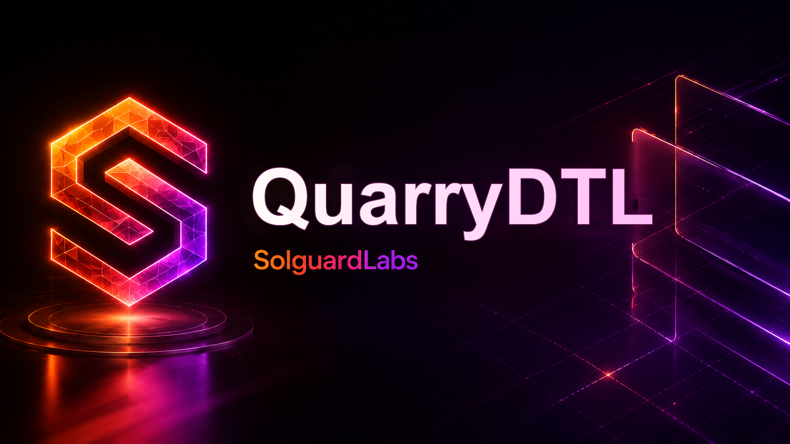

# QuarryDTL



QuarryDTL es un motor local de extraccion y asignacion de liquidez escrito en
Go. El sistema modela vaults internos, rutas de demanda, settlements diferidos,
previsiones de capacidad, rebalanceos operativos y ciclos de liquidacion para
auditorias reproducibles.

El binario no requiere servicios externos. Los tests TypeScript ejecutan la CLI
y validan el contrato JSON emitido por el motor.

## Componentes

- `src/amount.go`: cantidades enteras, escalas fijas y buckets por asset.
- `src/asset.go`: registro de activos, pesos de riesgo y fees.
- `src/account.go`: cuentas internas y balances operativos.
- `src/vault.go`: vaults, reservas, buffers, inflows y outflows pendientes.
- `src/route.go`: rutas de demanda entre vaults y parametros de settlement.
- `src/settlement.go`: lifecycle de settlements diferidos.
- `src/reservation.go`: reservas internas asociadas a asignaciones.
- `src/forecast.go`: previsiones de capacidad para rutas en curso.
- `src/planner.go`: vistas de capacidad observada y proyectada.
- `src/allocator.go`: construccion y ejecucion de batches de asignacion.
- `src/rebalance.go`: intents operativos de rebalanceo.
- `src/liquidation.go`: recuperacion de vaults bajo umbral de cobertura.
- `src/risk.go`: invariantes y metricas de auditoria.
- `src/report.go`: salida JSON estable para herramientas externas.
- `src/engine.go`: escenarios deterministas.
- `src/cli.go`: CLI `quarrydtl`.

## Requisitos

- Go 1.22 o superior.
- Node.js 24 o superior.

## Uso

Compilar:

```bash
node scripts/build.mjs
```

Listar escenarios:

```bash
out/quarrydtl --list
```

Ejecutar un escenario:

```bash
out/quarrydtl scenario rebalance
```

Validar invariantes de un escenario:

```bash
out/quarrydtl validate allocation
```

## Tests

```bash
npm test
```

La suite compila el binario y ejecuta:

```bash
node --test --experimental-strip-types "tests/node/*.test.ts"
```

Los escenarios publicos cubren:

- contrato CLI y salida JSON;
- asignacion de reservas ociosas;
- rebalanceo entre vaults internos;
- vistas de capacidad observada y proyectada;
- liquidacion de vaults bajo cobertura;
- ciclo operativo compuesto.

## CI

El workflow de GitHub Actions instala Go, Node.js y ejecuta:

```bash
bash scripts/ci.sh
```

El CI valida formato Go, `go vet`, `go test`, build del binario y tests
TypeScript.

## Estado Del Lab

QuarryDTL esta disenado como un repositorio autocontenido de revision tecnica.
La salida JSON de la CLI es el contrato principal para tests de regresion,
analisis de escenarios y tooling de auditoria.
